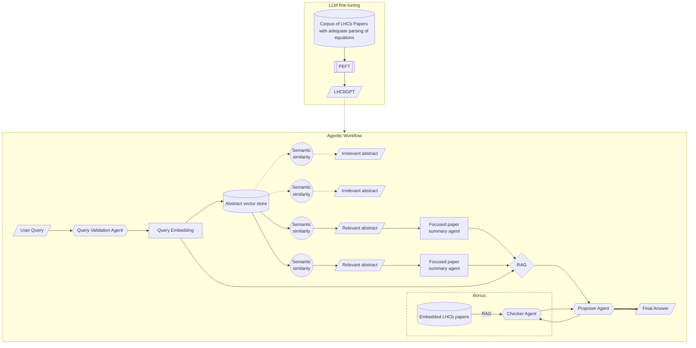

# BeautyInStats
An explainable agentic workflow as analysis copilot for LHCb OpenData and dissemination of best-practice methods for the apt evaluation of systematic uncertainties.  

## Design document 

### Architecture Details

#### Foundation Model Stage
- LLama foundation model as base architecture
- LHCb paper corpus curated to maintain apt embedding of text and equations
- PEFT-based domain adaptation (LoRA)
- Creates LHCbGPT: physics-aware LLM enabling the agentic workflow

#### User Query

- User query embedding 
- Validation agent: converts free-form physics queries into structured query cards following a fixed schema 
- Error handling for malformed queries

#### RAG System
- Abstracts are expert-compiled summaries
- Thus, semantic similarity between the validated query and the abstract enables the identification of papers most relevant to the user query
- For each identified paper, a _focused summary_ is generated from the entire paper, honing into the aspects most relevant to the user query
- RAG across all such summaries, to provide focus, and interpretability by way of keeping track of the references used to generate the final answer
- _NOTE_: this setup is likely achievable by graph-based RAG systems (under investigation)

#### Agentic Feeback

- Proposer Agent synthesizes solution from focused summaries
- [Optional] Checker Agent validates proposals against LHCb corpus and provides interaction for further refinement

### Technical Details
- `LangGraph` for orchestration
- `LLamaIndex` for traditional RAG
- `HuggingFace` for embedding, fine-tuning, and model sourcing. 
- ...

### Useful References

- [LoRA: Low-Rank Adaptation of Large Language Models](https://arxiv.org/abs/2106.09685)
- [From Local to Global: A Graph RAG Approach to Query-Focused Summarization](https://arxiv.org/abs/2404.16130)
- [Language agents achieve superhuman synthesis of scientific knowledge](https://arxiv.org/abs/2409.13740)
- [PACuna: Automated Fine-Tuning of Language Models
for Particle Accelerators](https://arxiv.org/pdf/2310.19106v3)
- [AI Engineering](https://www.oreilly.com/library/view/ai-engineering/9781098166298/)